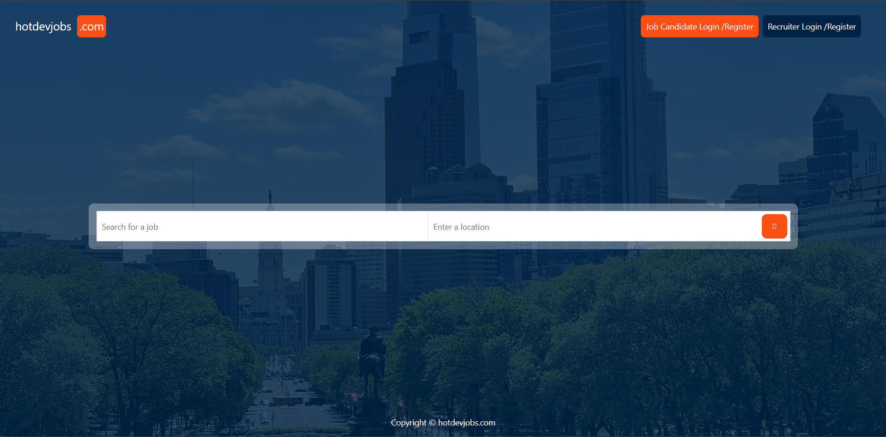
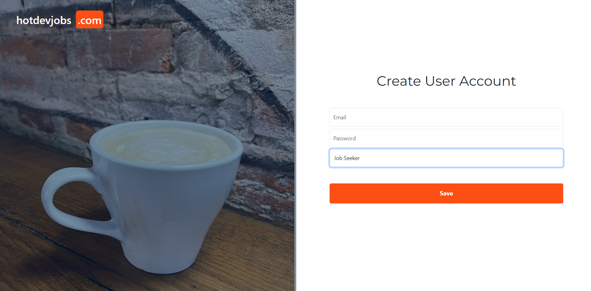
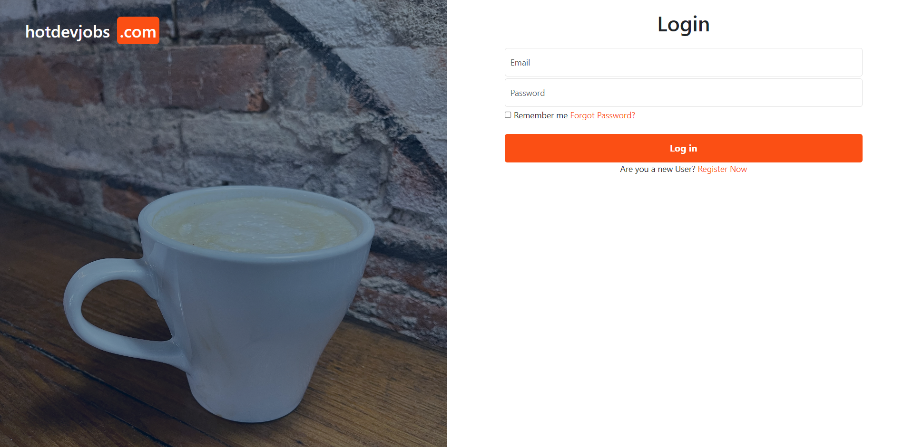
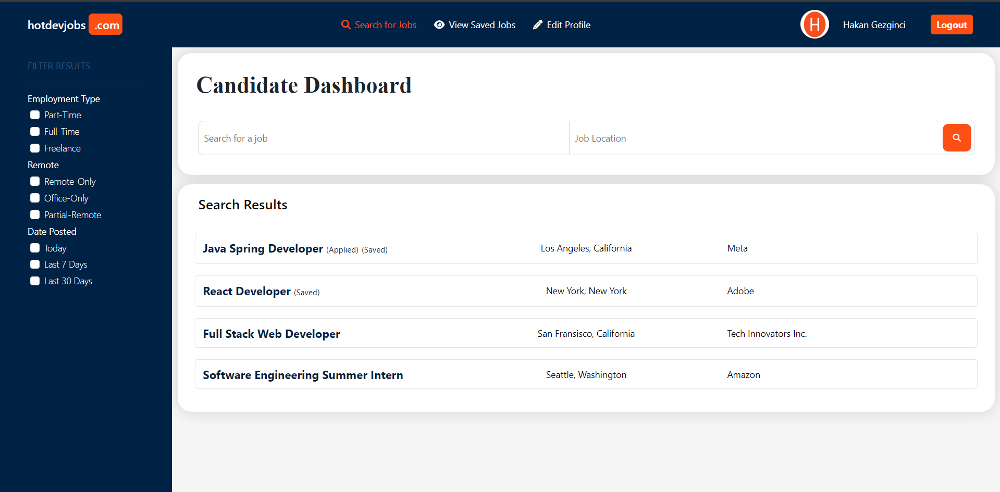
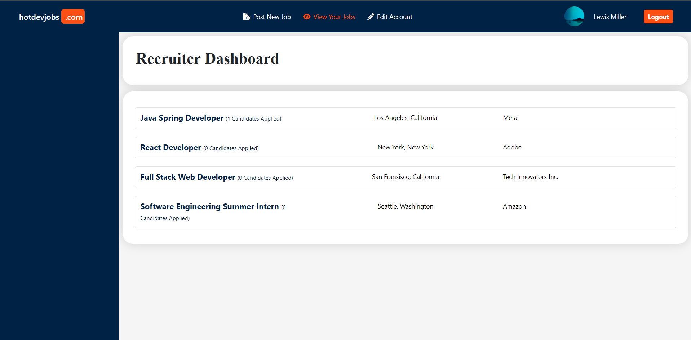
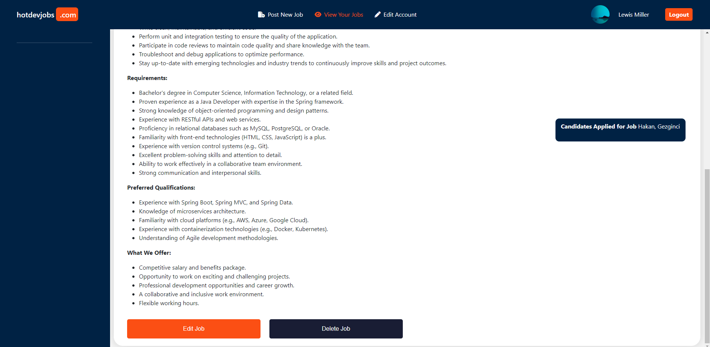
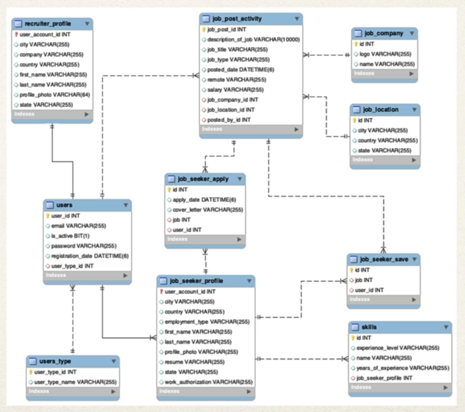

<h1 align="center"> Job Portal Web App </h1>

<!-- TABLE OF CONTENTS -->
<h2 id="table-of-contents"> :book: Table of Contents</h2>

  
Table of Contents

  <ol>
    <li><a href="#about-the-project"> ➤ About The Project</a></li>
    <li><a href="#overview"> ➤ Overview</a></li>
    <li><a href="#step1"> ➤ Screenshots </a></li>
    <li><a href="#step2"> ➤ Entity Relationships </a></li>
  </ol>

<!-- ABOUT THE PROJECT -->
<h2 id="about-the-project"> :pencil: About The Project</h2>

 
  The Job Portal Web App is a comprehensive platform designed to streamline the job recruitment process. It caters to two types of users: recruiters and candidates.

<!-- OVERVIEW -->
<h2 id="overview"> 🔐: Key Features</h2>

  <b>Job Listings:</b> Recruiters can post job openings, and candidates can view job posts with detailed descriptions.    
  <b>Resume Uploads:</b> Candidates can upload their resumes for recruiters to view.    
  <b>Application Tracking:</b> Recruiters can see who applied for their job posts, along with the candidate's information and resume.    
  <b>Global Job Search:</b> Users can search for jobs globally without the need to log in.

<!-- STEP1 -->
<h2 id="step1"> 📷: Screenshoots:</h2>

  

  

  

  

  

  

<!-- STEP2 -->
<h2 id="step2"> :small_orange_diamond: Entity Relationships</h2>

  

This schema effectively models our job portal system with clear relationships between users, their profiles, job postings, and interactions such as saving and applying for jobs. Each table has a specific role and is interconnected through foreign keys to ensure referential integrity.

<h3>Relationships and Interactions</h3>  
<b>Users:</b> Divided into recruiters and job seekers through the users_type table. Each user has a profile stored in either recruiter_profile or job_seeker_profile.  
<b>Job Postings:</b> Managed by recruiters, stored in job_post_activity, with references to companies (job_company) and locations (job_location).   
<b>Job Seekers:</b> Can save (job_seeker_save) and apply (job_seeker_apply) to job postings. Their skills are tracked in the skills table.  
